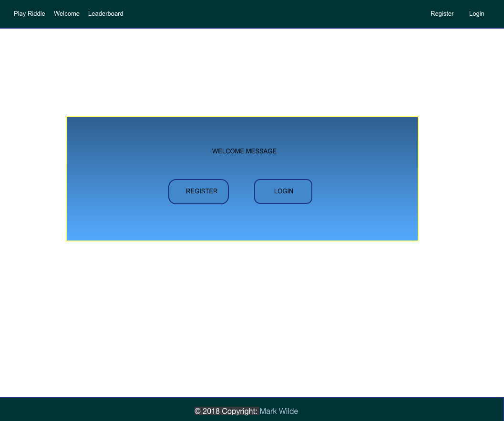
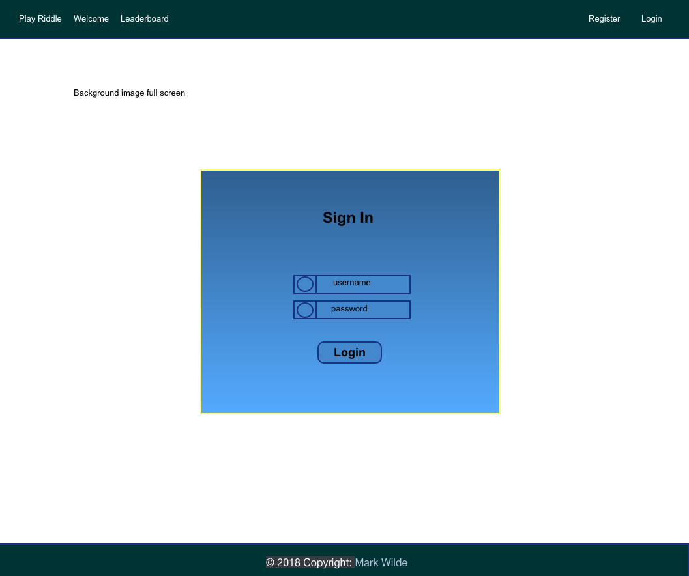
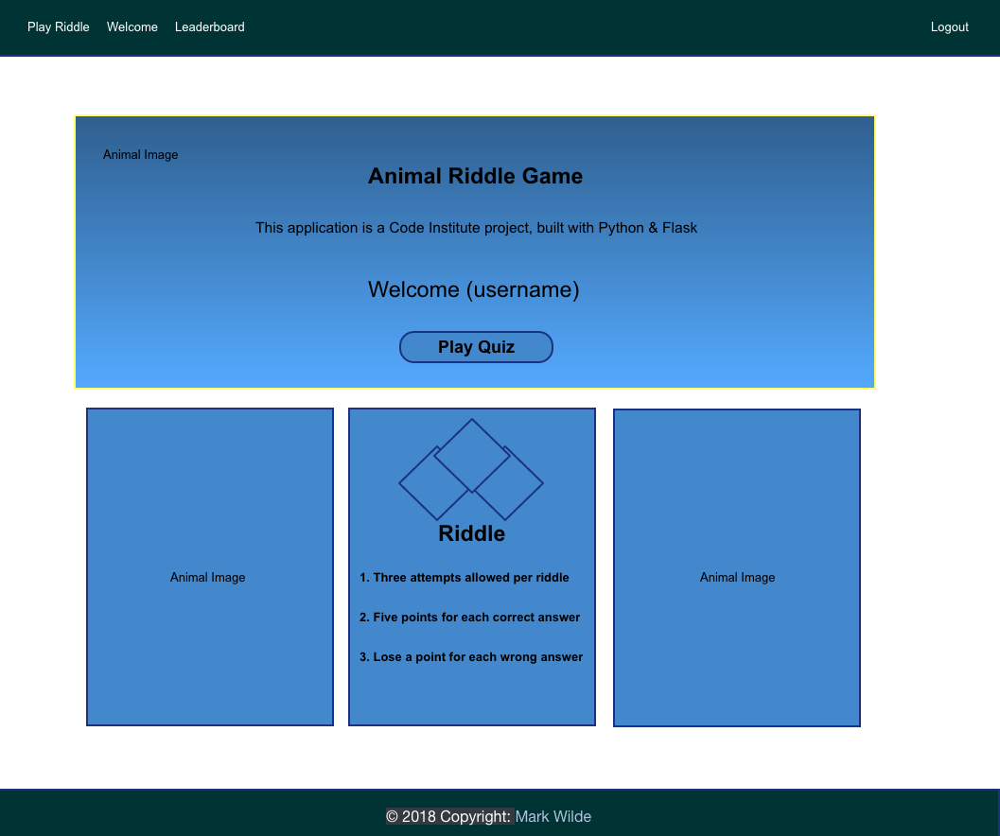
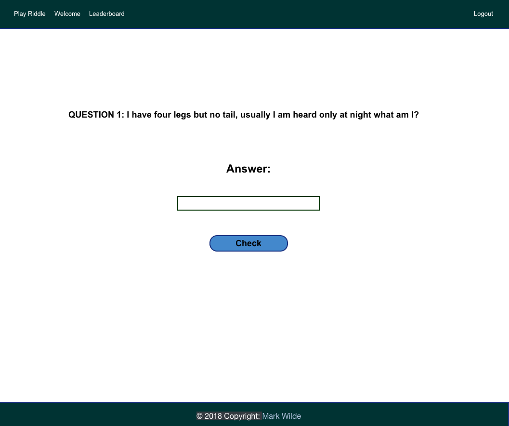
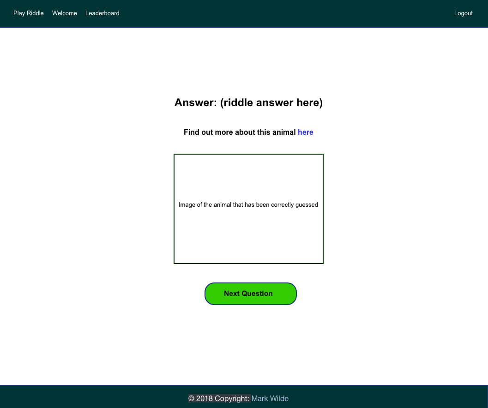
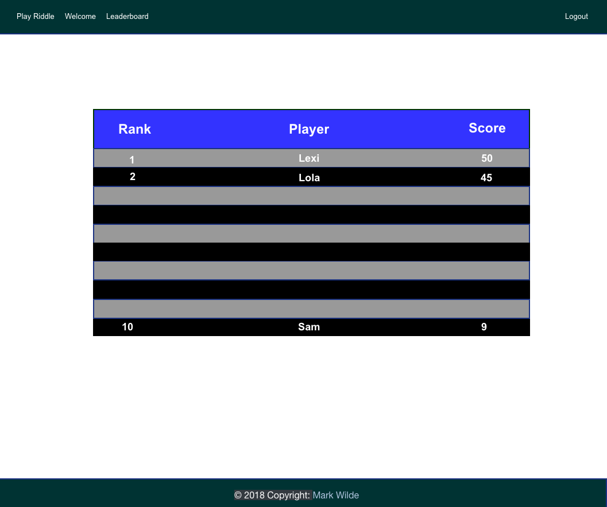

# Animal Riddle Game

### Code Institute: Practical Python Milestone Project

<a href="http://flask-riddle.herokuapp.com" target="_blank"> Click here to view website</a>

*Developer: Mark Wilde*

-------


## Index


1. [Project Instructions](#instructions-from-code-institute)
2. [Riddle Information](#riddle-information)
3. [UX](#ux)
    * [Wireframes](#wireframes)
    * [Design](#design)
    * [User Stories](#user-stories)
4. [Features](#features)
5. [Technologies](#technologies-used)
6. [Testing](#testing)
7. [Deployment](#deployment)
8. [Installation](#installation)
9.  [Credits](#credits)


## Instructions From Code Institute


Guidelines for project development:


- The project's logic must be written in Python, HTML and CSS. Use flask, a micro-framework, to structure your project's back-end. 
- Build a web application game that asks players to guess the answer to a pictorial or text-based riddle.
- The player is presented with an image or text that contains the riddle. Players enter their answer into a textarea and submit their answer using a form.
- If a player guesses correctly, they are redirected to the next riddle.
- If a player guesses incorrectly, their incorrect guess is stored and printed below the riddle. The textarea is cleared so they can guess again.
- Multiple players can play an instance of the game at the same time, each in their own browser. Users are identified by a unique username, but note that no authentication features such as a password are required for this project.
- Create a leaderboard that ranks top scores for all (at least recent) users.
- You should conduct and document tests to ensure that all of your website’s functionality works well.
- Write a README.md file for your project.
- Use Git & GitHub for version control.
- Deploy the final version of your code to a hosting platform such as Heroku.


## Riddle Information


- Players are requested to register and login to play the game. They can then read the rules or began a game immediately.
- The game consists of 10 animal riddles.
- Players are allowed 3 guesses per riddle.
- Players receive 5 points for each correct answer.
- Players are deducted 1 point for each incorrect answer.
- Players are shown a question and can input their answer in the answer field. Players click the check button to confirm their answer.
- When players give a correct answer they receive a success message and are shown an image of the animal. A link with further information regarding the animal is displayed above the image.
- Players continue with the riddle by clicking on the next question button which displays below the animal image when a correct answer is given.
- When players give an incorrect answer they receive a warning message which also displays how many attempts they have left.
- When a player gives 3 incorrect answers they receive a warning message and are taken to the next riddle.
- On completion of the riddle players receive a message with their final score. They are then directed to back to the start quiz page.
- Players can go to the leaderboard at any time to see if they made the top ten.


## UX


### Wireframes


[Pencil](https://pencil.evolus.vn/) was used to create the wireframes.


<details>
      <summary><strong><em>Index page</em></strong></summary>

  
</details> 

<details>
   <summary><strong><em>Register page</em></strong></summary>
  
  
</details> 

<details>
   <summary><strong><em>Login page</em></strong></summary>
  
  
</details> 

<details>
   <summary><strong><em>Start quiz page</em></strong></summary>
  
  
</details> 

<details>
   <summary><strong><em>Play quiz page one</em></strong></summary>
  
  
</details> 

<details>
   <summary><strong><em>Play quiz page two</em></strong></summary>
  
  
</details> 


<details>
  <summary><strong><em>Leaderboard page</em></strong></summary>
  
  
</details> 


### Design


- Development of the website adhered to a mobile first approach. The site consists of six pages. It uses a simplistic design with minimal content, allowing users to focus on the riddle game. 
  
- Some psychedelic animal images from the artist [Alex Grey](https://m.alexgrey.com/)were used to give the site some personality. Background images were used on some pages to add depth. An image on the start quiz page is hidden on smaller screens to improve the aesthetic.

- All pages share the same navbar and footer, though each page has a clear purpose and some unique functionality.
  
- The Bootstrap framework underpins the project and was implemented as per convention.

- The websites animal art was chosen as it is thought provoking and a little mysterious, this theme ties in well with the sites main purpose, it being an animal riddle quiz. 
 
- A picture of each animal displays on each correct answer, to keep users engaged.
  
- links to external sites with additional information were included, for those users who like to have easy access to further information.


### User Stories


Several user stories were considered before development began:


1. "As an animal lover I want to play a simple but engaging quiz game to test my knowledge."
 
2. "As an animal lover I want to see pictures of the animals used in the quiz and have an option to read more about each animal."

3. "I want to be able to register a username and sign in. I can then play multiple games and try to beat my previous scores."

4. "I want to be welcomed to the quiz by my unique username and have the rules presented to me before I play the game."

5. "On completion of the quiz I want to see my score and be able to visit a leaderboard. Did I make the top ten? If so, were did I rank?"

6. "I want to play the quiz at the same time as my friends, each on our own browsers, and see who does the best."

7. "I want to be informed how of many guesses I have left when I get a question wrong."

8. "I want to be able to logout at any stage, even if I am in the middle of a game."


## Features


| Page        |                                                                                                                                                                                                                                                                           Description                                                                                                                                                                                                                                                                           |
| :---------- | :-------------------------------------------------------------------------------------------------------------------------------------------------------------------------------------------------------------------------------------------------------------------------------------------------------------------------------------------------------------------------------------------------------------------------------------------------------------------------------------------------------------------------------------------------------------: |
| Index       |                                                                                                                                                                                                                            This the the landing page. It is a basic page with a banner image, a register button and a login button.                                                                                                                                                                                                                             |
| Register    |                                                                                                                                                                                             This page has a basic form for new users to register. It has a background image. There is also a link to the login page for those users who have previously registered.                                                                                                                                                                                             |
| Login       |                                                                                                                                                                                                                                            This page has a basic form for users to login. It has a background image.                                                                                                                                                                                                                                            |
| Start Quiz  |                                                                                                                                                 This page has a banner image with a welcome message. It has three image cards two of which contain animal art, the final card contains a riddle image and the riddle rules and is placed between the animal cards. These tree cards sit below the banner image.                                                                                                                                                 |
| Play Quiz   | This page contains the questions and answers for the quiz. Users input their answers in an answer box and click on the check button. When an answer is correct an image of the animal is displayed, a link for further information is provided; and users can click on the next question button to continue the quiz. When an answer is incorrect it is displayed in a warning message which also shows the number of remaining attempts available. When there are three incorrect attempts users receive a 'hard luck' message and the next question displays. |
| Leaderboard |                                                                                                                                                                                                                    This page provides a leaderboard table with the top ten user scores. It displays the user rank, user name and user score.                                                                                                                                                                                                                    |


## Existing/Future Technologies


- Another riddle which unlocks when users get a score of 40 points or more. This riddle would have a further 10 questions about animals and it's own leaderboard.
  
- A page hosting a photo collection and interesting information about each riddle animal.


## Technologies Used


### Virtual Environment


- [Pipenv](https://pipenv.readthedocs.io/en/latest/)
    - The project uses **Pipenv** to set a virtual environment.


### Front end


- [HTML](https://www.w3schools.com/html/default.asp)
    - The project uses **HTML** to create the pages.

- [CSS](https://www.w3schools.com/css/default.asp)
    - The project uses **CSS** to style the pages.

- [Bootstrap CSS Framework](https://getbootstrap.com/)
    - The project uses **Bootstrap** for styling and responsive design.

- [FontAwesome Icons](https://fontawesome.com/)
    - The project uses **FontAwesome** icons on the login form.

- [JQuery](https://jquery.com)
    - The project uses Bootstrap's **JQuery** for responsiveness.
  
- [JSON](https://www.json.org/)
    - The project uses **JSON** to organize data in files.
  


### Back end


- [Python](https://www.python.org/)
    - The project uses **Python** as per instructions.
  
- [Flask](http://flask.pocoo.org/)
    - The project uses the **Flask** micro web framework as per instructions.


### Version Control


- The project uses [Git](https://git-scm.com) as it's version control system.
  
- The project uses  a  [Github](https://github.com/markwilde33/CI-project-three) repository.

   


## Testing


<details>
      <summary><strong><em>User Story Tests</em></strong></summary>

#### User Tests:

1. Verify that it is a simple animal quiz game.
2. Verify that a user will have their knowledge of animals tested.
3. Verify that users are shown pictures of each animal for each correct guess.
4. Verify that users can find out more about each animal by clicking on a link.
5. Verify that users can register a username and sign in.
6. Verify that users can play multiple games, and try and beat their previous scores.
7. Verify that users are welcomed to the quiz by their unique username, and can read the riddle rules.
8. Verify that users are shown their score when they complete the quiz.
9. Verify that users can visit a leaderboard to see if they ranked in the top ten.
10. Verify that multiple users can play at the same time, providing they do so from their own browser.
11. Verify that users are informed of how many remaining guesses they have left when they input an incorrect answer.
12. Verify that users can logout and exit the game at anytime.
</details> 


<details>
      <summary><strong><em>Manual Tests</em></strong></summary>

  
#### Index Page:
   
1. Go to the "Index page" page.
2. Click on the Register button and verify that the user is redirected to the      register page.
3. Click on the Login button and verify that the user is redirected to the         login page.
4. Users must be logged in to access the leaderboard. Click on the Play Riddle, Welcome and Leaderboard links in the navbar and verify that users are denied access to these pages. 
5. Verify that users are taken to the register page and receive the following      flashed message "You are unauthorized to perform this action. Please            register and/or login first".
6. Click on the link in the footer and verify that it loads on a separate page.


#### Register Page:
   
1. On the index page, click on the register button and the register link in the navbar, verify that both these actions take the user to the register page.
2. Try to submit the empty form and verify that an error message about the         required fields appears.
3. Try to submit the form with all inputs valid and verify that a success          message appears, and that the user is taken to the login page.
4. Verify tht the user is taken to the login page when they click on the           optional "Already Registered? Sign In" link below the register button.


#### Login Page:
   
1. Try to submit the empty form and verify that an error message about the         required fields appears.
2. Try to submit the form with an invalid email address and verify that a          relevant error message appears.
3. Try to submit the form with an invalid password and verify that a relevant      error message appears.
4. Try to submit the form with all inputs valid and verify that a success          message appears, and that users are taken to the start quiz page.
   

#### Start Quiz Page:
   
1. Click on the "Play Quiz" button and verify the play quiz page is loaded.
2. Click on the "Play Riddle" link in the navbar and verify the play quiz page     is loaded.
3. Click on the "Leaderboard" link in the navbar and verify the leaderboard        page is loaded.
4. Click on the "Logout" link in the navbar and verify the user is logged out      and taken to the login page.
5. Verify that images and riddle rules are being displayed.


#### Play Quiz Page:
   
1. Verify that the questions are displaying.
2. Leave the answer field empty and click on the "Check" answer button. Verify     that the user receives an error message.
3. Enter an incorrect answer and verify the user receives a warning; which         displays the answer they gave and shows their remaining attempts.
4. Enter three wrong answers and verify that users receive a "hard luck"           warning message, and are taken to the next question.
5. Enter a correct answer and verify that users receive a success message.
6. Enter a correct answer and verify an animal image is displayed.
7. Enter a correct answer and verify a link with additional information about      the animal is displayed.
8. Enter a correct answer and verify the "Next Question" button displays.
9. Click on the "Next Question" button and verify the next question displays.
10. When a user enters three incorrect answers on the final question, verify        the user is taken to the start quiz page, where there score is displayed in a message at the top of the screen.
11. When a user correctly guesses the final question, verify that the "Finish"      button displays.
12. Verify the user is taken to the start quiz page when the "Finish" button is     clicked, and that their final score is displayed at the top of the screen.


#### Leaderboard Page:
   
1. Verify that the top ten user scores are displayed on the leaderboard page.
2. Verify that the rank, player name and score of the top ten users are            displayed.
</details> 


<details>
      <summary><strong><em>Automated Tests</em></strong></summary>


#### Unit Tests:

A file called riddle_tests.py was created using Python's **unittest** class.

The two tests in this file are displayed below:


*Test 1*

```python
 def test_get_users(self):
        """
        Test to ensure the users list can be retrieved from users.json
        """
        users = app.get_users()
        self.assertEqual(len(users), 1)
```

*code in app.py*

```python
USERS = os.path.join(os.path.dirname(
    os.path.abspath(__file__)) + '/data/users.json')

def get_users():
    # retrieve users from users.json
    users = {}
    with open(USERS) as reader:
        users = json.load(reader)
    return users
```

---

*Test 2*

```python
def test_get_leaders(self):
        """
        Test to ensure the leaders list can be retrieved from leaderboard.json
        """
        leaders = app.get_leaders()
        self.assertEqual(len(leaders), 1)
```

*code in app.py*

```python
LEADERBOARD = os.path.join(os.path.dirname(
    os.path.abspath(__file__)) + '/data/leaderboard.json')

def get_leaders():
     # retrieve leaders from leaderboard.json
    leaders = {}
    with open(LEADERBOARD) as reader:
        leaders = json.load(reader)
    return leaders
```

---
</details> 


<details>
      <summary><strong><em>Miscellaneous</em></strong></summary>


### Further Testing

- Google chrome developer tools where used at every stage of production to
isolate issues and improve mobile responsiveness.
- The app has been tested on various browsers, including Chrome, Firefox, Opera, and Safari.
- The app was tested across many screen sizes, from very small to very large.
- It is displaying as intended across various devices and in different browsers.


### Issues

- The author is not yet proficient in automated testing, and as such, was unable to adhere to a test driven development approach.
- On the start quiz page, there is an issue where, on some screen sizes, the riddle card displays at a different height than the animal image cards.  
- There is some white space between the flashed messages and the navbar. As some pages use full size background images this pushes the images down a little.
</details> 


## Deployment


The website has been deployed to [Heroku](https://www.heroku.com/) and can be accessed [here](https://flask-riddle.herokuapp.com/)


**Heroku Deployment**


1. Create an [Heroku](https://www.heroku.com/) account.

2. Create a new app 'flask-riddle' on heroku.com

3. Install [Heroku CLI](https://devcenter.heroku.com/articles/heroku-cli):
    ``` 
    $ brew install heroku/brew/heroku
    ``` 
4. Login to heroku:
    ``` 
    $ heroku login
    ``` 
5. Check app has been created by heroku:
    ``` 
    $ heroku apps
    ``` 
6. Add heroku remote:
    ``` 
    $ heroku git:remote -a flask-riddle
    ``` 
7. Add requirements.txt file (allows heroku to access the projects build pack. This project uses a Pipenv virtual environment, a Pipfile.lock file is automatically generated which contains the build pack. However, this step has been included for reasons of best practice):
    ``` 
    $ sudo pip3 freeze --local > requirements.txt
    $ git add requirements.txt
    $ git commit -m " Added a requirements.txt"
    $ git push heroku master
    ``` 
8.  Add Procfile (Instructs heroku how start running the project):
    ``` 
    $ echo web: python app.py > Procfile
    $ git add Procfile
    $ git commit -m 'Added Procfile'
    $ git push heroku master
    ``` 
9.  Set up dynos:
    ``` 
    $ heroku ps:scale web=1
    ``` 
10. Setup config variables on heroku dashboard:
    - Go to settings and click on reveal config vars
    - Set IP to 0.0.0.0
    - Set PORT to 5000

11. Restart dynos:
    - Navigate into the 'More' menu and select 'Restart all dynos' to update the apps settings.

12. Open app:
    - Click on the 'Open app' button to view your heroku deployed app in the browser.
  


## Installation


``` 
from the console type:

$ git clone https://github.com/markwilde33/CI-project-three
$ cd CI-project-three
$ pip3 install -r requirements.txt 
$ python3 app.py

```
App available at http://127.0.0.1:5000/


## Credits


[Code Institute](https://codeinstitute.net/)

The Html Fundamentals module, CSS Fundamentals module, Python Fundamentals module,Practical Python module and the Data Centric Development module were used for guidance.


### Content


- [Wikipedia](https://en.wikipedia.org/wiki/Animal) was used for animal information.
- [Youtube](https://www.youtube.com/watch?v=c0IRci0nz14) was used for animal riddles.


### Media


- [Google Images](https://www.google.com/search?q=google+images+alex+grey+animal+art&rlz=1C5CHFA_enIE780IE780&tbm=isch&tbo=u&source=univ&sa=X&ved=2ahUKEwjHo727o-PfAhXSC-wKHVndCBMQsAR6BAgGEAE&biw=1062&bih=978) was used for the animal art.


### Acknowledgements


- I received inspiration for this project from [Code Institute](https://codeinstitute.net/), [The Net Ninja](https://www.thenetninja.co.uk), [Brad Traversy](https://www.traversymedia.com/) and [Corey Schafer](https://www.youtube.com/user/schafer5/featured).

